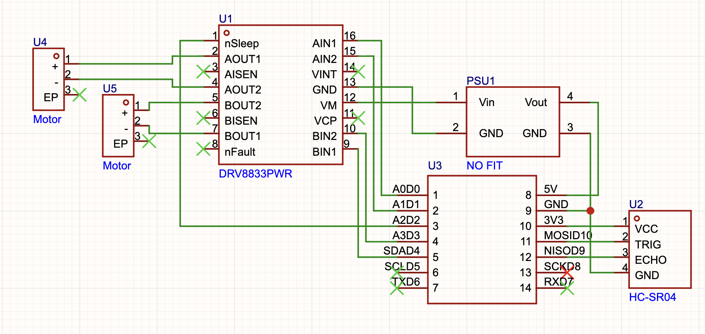

<div align="center">

# 

# AliPay Bot

<p>


</p>

### *Your personal shopping assistant.*

<p align="center">

</p>

</div>

---

# Overview

**AliPay Bot (支付宝)** is an autonomous customer-assistance robot designed to improve shopping experiences by combining mobile robotics, facial recognition, and digital payment systems.

The robot follows customers around a store, recognizes them using facial recognition, and provides a personalized experience by greeting customers by name.

A **smartphone mounted on top of the robot's head** serves as the primary user interface. The smartphone performs facial recognition while customers shop and displays the customer's **Alipay QR payment code** once shopping is complete, enabling a fast and convenient checkout experience without traditional checkout counters.

The robot is built on a wheeled platform with obstacle avoidance capabilities, allowing it to safely navigate indoor environments while following customers.

The project explores autonomous navigation, embedded systems, human-computer interaction, and smart retail automation.

## Key Hardware

- Seeed Studio XIAO RP2040 Microcontroller
- DRV8833 Motor Driver
- LM2596 Buck Converter
- 7.9V Series Battery Pack (2× 1S Lithium Batteries)
- Ultrasonic Sensors
- Smartphone (Facial Recognition & QR Payment Display)

---

# Gallery

<div align="center">

<table>
<tr>
<td align="center">

</td>
<td align="center">

</td>
</tr>

<tr>
<td align="center">

</td>
<td align="center">

</td>
</tr>

<tr>
<td colspan="2" align="center">

</td>
</tr>

</table>

</div>

---

# Zine

<div align="center">


</div>

---

# Product Demo

<div align="center">

https://github.com/user-attachments/assets/9393cabb-99f1-4ce1-a9d7-702ce5b00068

<br>

Product demonstration showing AliPay Bot's autonomous customer following, facial recognition, obstacle avoidance, and smartphone-based Alipay QR payment workflow.

</div>

---

# Motivation

Traditional shopping experiences often require customers to wait in queues and manually complete payment processes.

AliPay Bot was designed around a simple idea:

> **How can robotics make everyday shopping faster, smarter, and more interactive?**

The goal was to create a mobile assistant capable of:

- Following customers autonomously
- Providing personalized interaction
- Improving customer engagement during shopping
- Combining robotics with digital payment systems

Inspired by:

- Autonomous robots
- Smart retail systems
- Embedded electronics
- Human-machine interaction
- Modern payment technology

The result is a robotic shopping assistant that combines mobility, recognition, and digital payment into a single platform.

---

# Features

- Autonomous customer following
- Facial recognition system
- Personalized customer greetings
- Obstacle avoidance
- Smartphone-based QR payment display
- Wheeled robotic platform
- Wireless embedded control
- Compact electronics integration
- Custom 3D-designed mechanical structure

---

# Hardware Stack

| Parameter | Value |
|------------|-------|
| Controller | Seeed Studio XIAO RP2040 |
| Motor Driver | DRV8833 |
| Power Source | 2× 1S Lithium Batteries (Series) |
| Battery Output | 7.9V |
| Voltage Regulation | LM2596 Buck Converter |
| Sensors | Ultrasonic Sensors |
| Recognition | Smartphone Camera |
| Movement | DC Motors |
| Payment Interface | Smartphone Display |
| Communication | Embedded Control System |

---

# Electronics Architecture

The robot is powered using two **1S lithium batteries connected in series**, producing approximately **7.9V**.

An **LM2596 buck converter** regulates the battery voltage to provide a stable supply for the control electronics.

The **Seeed Studio XIAO RP2040** acts as the main controller, processing sensor inputs and controlling the motors through the **DRV8833 motor driver**.

The smartphone mounted on top of the robot handles facial recognition and displays the customer's Alipay QR payment code after shopping is complete.

```text
7.9V Battery Pack
(2× 1S Lithium Batteries in Series)
           │
           ▼
 LM2596 Buck Converter
           │
           ▼
     XIAO RP2040
      ┌──────────────┐
      │              │
      ▼              ▼
DRV8833 Driver   Ultrasonic Sensors
      │
      ▼
   DC Motors

Smartphone
 ├── Facial Recognition
 └── Alipay QR Payment Display
```

---

# Component Overview

| Component | Purpose |
|-----------|---------|
| 1S Lithium Batteries | Main power source |
| LM2596 Buck Converter | Voltage regulation |
| Seeed Studio XIAO RP2040 | Main processing unit |
| DRV8833 Motor Driver | Controls the DC motors |
| Ultrasonic Sensors | Obstacle detection and distance measurement |
| Smartphone | Facial recognition and Alipay QR payment display |
| DC Motors | Differential drive locomotion |

---

# Wiring Diagram

The electronics are connected using direct point-to-point wiring based on the designed schematic.

No custom PCB was manufactured for this prototype.

The documentation includes:

- Complete wiring schematic
- Component interconnections
- Power distribution
- Motor driver connections
- Sensor wiring

## Schematic

<div align="center">



</div>

---

# Mechanical Design

The robot was designed using 3D CAD software with a compact, modular architecture suitable for indoor retail environments.

The design focuses on accessibility, easy assembly, and efficient placement of electronic components while maintaining a clean appearance.

The mechanical structure includes:

- Wheeled differential-drive chassis
- Electronics mounting platform
- Ultrasonic sensor mounts
- Smartphone mounting bracket positioned on top of the robot's head
- Battery compartment
- Internal cable routing for clean wiring

The completed prototype and internal assembly are shown in the Gallery above.

---

# Working Process

```text
Customer Enters Store
        │
        ▼
Facial Recognition
        │
        ▼
Customer Identified
        │
        ▼
Robot Greets Customer
        │
        ▼
Robot Follows Customer
        │
        ▼
Obstacle Detection
        │
        ▼
Shopping Completed
        │
        ▼
Smartphone Displays
Alipay QR Code
        │
        ▼
Payment Completed
```

---

# Assembly Guide

## 1. Prepare Components

Required components are listed in:

```text
./Hardware/Components/
```

Ensure all electronic components, batteries, motors, sensors, and 3D printed parts are available before beginning assembly.

---

## 2. Assemble the Mechanical Structure

Assemble the robot using:

- 3D printed chassis
- Motor mounts
- Wheel assemblies
- Sensor brackets
- Smartphone holder
- Electronics enclosure

Secure all components before installing the electronics.

---

## 3. Install the Electronics

Follow the wiring schematic located at:

```text
./Hardware/Schematic.png
```

Connect the system in the following order:

- Battery pack → LM2596 Buck Converter
- LM2596 → XIAO RP2040
- XIAO RP2040 → DRV8833 Motor Driver
- DRV8833 → DC Motors
- Ultrasonic Sensors → XIAO RP2040
- Mount the smartphone on the top bracket

Double-check all polarity and power connections before powering the robot.

---

## 4. Configure the Smartphone

Mount the smartphone securely on top of the robot.

The smartphone is responsible for:

- Running the facial recognition application
- Identifying customers
- Displaying personalized greetings
- Showing the customer's Alipay QR payment code after shopping

Ensure the phone is securely attached and positioned for reliable camera visibility.

---

## 5. Test Movement

Before installing the top cover, verify the following:

- Correct motor direction
- Stable power supply
- Sensor readings
- Obstacle detection
- Controller operation
- Smartphone positioning

---

## 6. Final Validation

Perform a complete system test.

Verify that the robot can:

- Detect a customer
- Recognize the customer's face
- Follow the customer
- Avoid nearby obstacles
- Stop safely
- Display the Alipay QR code on the mounted smartphone

---

# Applications

AliPay Bot demonstrates how autonomous robotics can improve customer interaction within modern retail environments.

Potential applications include:

- Smart retail stores
- Customer assistance robots
- Interactive shopping experiences
- Autonomous indoor delivery
- Shopping mall guidance
- Exhibition and trade show assistants
- Educational robotics
- Human-robot interaction research
- Embedded systems demonstrations
- Autonomous navigation research

---

# Repository Structure

```text
AliPayBot/
├── CAD/
├── Firmware/
├── Hardware/
│   ├── Components/
│   └── Schematic/
├── Gallery/
├── LICENSE
└── README.md
```

---

# Current Status

- [x] Concept Design
- [x] 3D CAD Development
- [x] Mechanical Assembly
- [x] Electronics Integration
- [x] Wiring Design
- [x] Autonomous Navigation Testing
- [x] Obstacle Avoidance
- [x] Facial Recognition Integration
- [x] Smartphone QR Payment Interface
- [x] Final Prototype Validation

---

# Future Improvements

Future versions of AliPay Bot may include:

- SLAM-based indoor navigation
- AI-powered customer interaction
- Voice recognition and speech synthesis
- Autonomous charging dock
- Inventory assistance
- Multi-customer tracking
- Cloud-connected analytics
- Mobile application integration
- Improved localization and mapping

---

# Contributing

Contributions, suggestions, and feedback are always welcome.

If you'd like to improve **AliPay Bot**, simply fork the repository and submit a pull request.

```bash
git clone https://github.com/Sudo-Aju/AliPayBot.git

cd AliPayBot
```

Workflow:

1. Fork the repository
2. Create a new feature branch
3. Make your changes
4. Commit your work
5. Push your branch
6. Open a Pull Request

Please ensure your changes are well documented and tested before submitting.

---

# Creators

### Azmeer Pirani

### Keyaan

### Anirudh

---

# Built With ❤️ For

- Robotics
- Embedded Systems
- Autonomous Machines
- Smart Retail Technology
- Human–Robot Interaction

---

# Acknowledgements

Special thanks to everyone who contributed ideas, testing, and feedback throughout the design and development of this project.

AliPay Bot represents an exploration of how autonomous robotics, embedded electronics, and modern digital payment systems can work together to create a more engaging retail experience.

---

# License

This project is licensed under the **MIT License**.

You are free to use, modify, and distribute this project in accordance with the terms of the license.

---

<div align="center">

# ZHI FU BAO

### *Your Personal Shopping Assistant.*

Designed and built with ❤️ using robotics, embedded systems, and modern retail technology.

</div>
