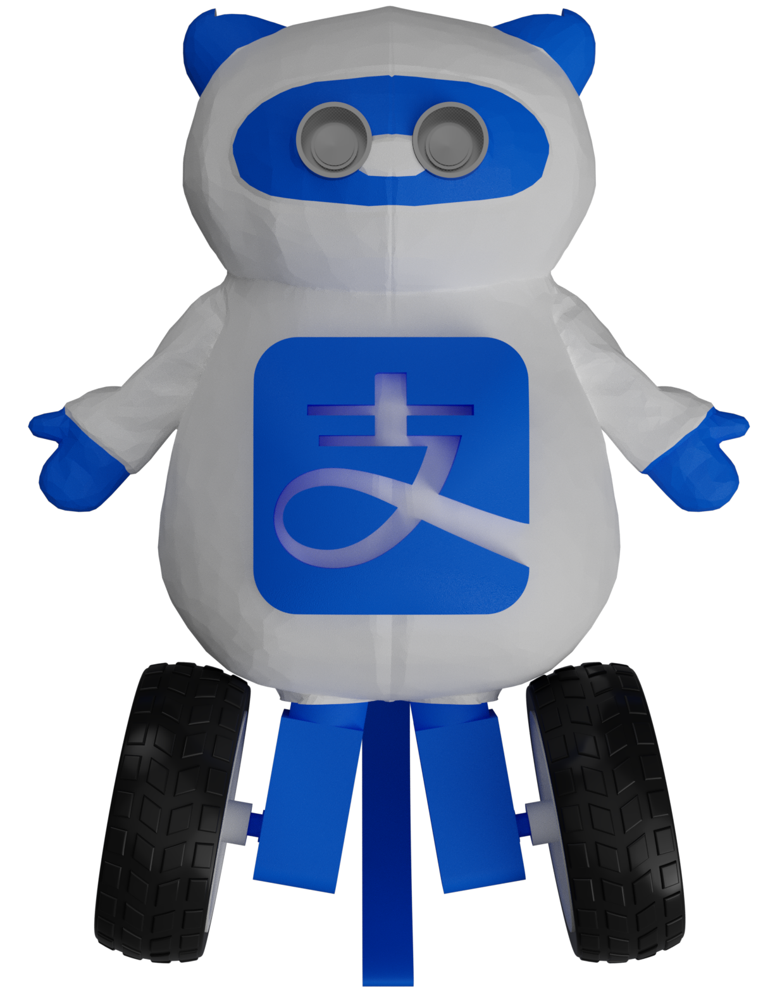
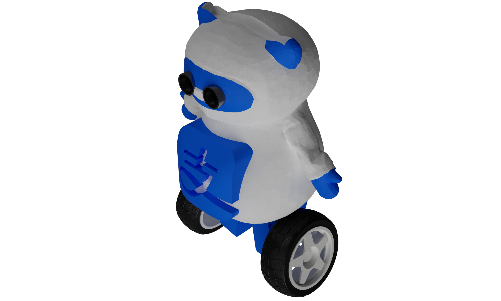
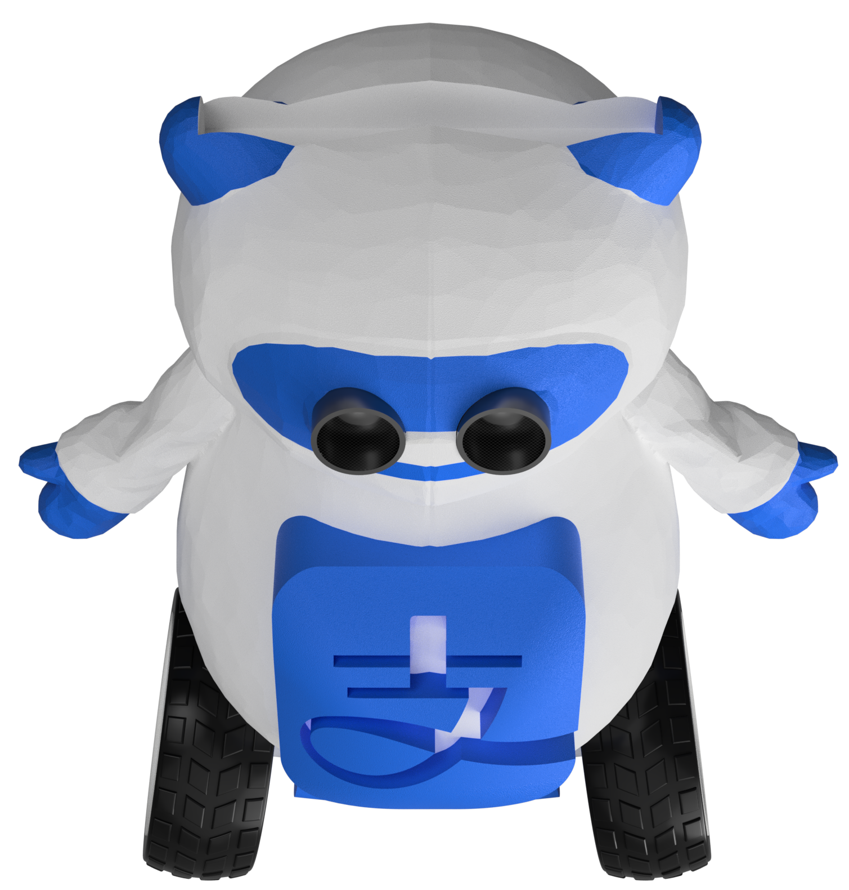
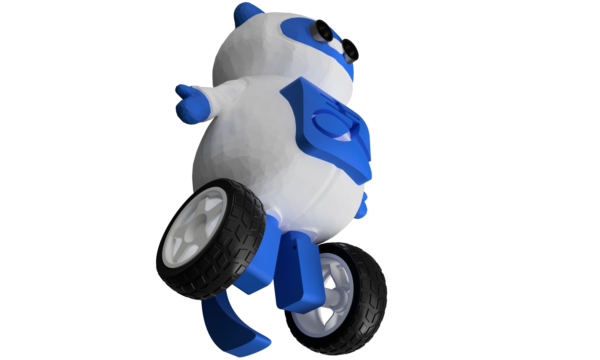

<div align="center">


# 

# AliPay Bot

<p>


</p>

### _Your personal shopping assistant._

<p align="center">
  
  
  
  
</p>

</div>

---

# Overview

**AliPay Bot (支付宝)** is an autonomous customer-assistance robot designed to improve shopping experiences by combining mobile robotics, facial recognition, and digital payment systems.

The robot follows customers around a store, recognizes them using facial recognition, and provides a personalized experience by calling customers by their name.

After customers complete their shopping, Zhi Fu Bao displays their **Alipay QR payment code**, allowing them to complete transactions quickly without waiting at traditional checkout counters.

The robot is built on a wheeled platform with obstacle avoidance capabilities, allowing it to navigate indoor environments while safely following customers.

Key hardware includes:

- Seeed Studio XIAO RP2040 Microcontroller
- DRV8833 Motor Driver
- LM2596 Buck Converter
- 7.9V Series Battery Pack (2 1s Batteries in Series 
- Ultrasonic Sensors
- Phone for Facial Recognition
- Phonr for QR Payment

The project explores autonomous navigation, embedded systems, human-computer interaction, and smart retail automation.

---

# Gallery

<div align="center">





</div>

---

# Zine

<div align="center">


</div>

---

# Motivation

Traditional shopping experiences often require customers to wait in queues and manually complete payment processes.

Zhi Fu Bao was designed around a simple idea:

> How can robotics make everyday shopping faster and more interactive?

The goal was to create a mobile assistant capable of:

- Following customers autonomously
- Providing personalized interaction
- Reducing checkout time
- Combining robotics with digital payment systems

Inspired by:

- Autonomous robots
- Smart retail systems
- Embedded electronics
- Human-machine interaction
- Modern payment technology

The result is a robotic assistant that combines mobility, recognition, and payment into a single platform.

---

# Features

- Autonomous customer following
- Facial recognition system
- Personalized customer greetings
- Obstacle avoidance
- QR payment display system
- Wheeled robotic platform
- Wireless embedded control
- Compact electronics integration
- 3D designed mechanical structure

---

# Hardware Stack

| Parameter | Value |
|-------------------|--------------|
| Controller | Seeed Studio XIAO RP2040 |
| Motor Driver | DRV8833 |
| Power Source | Series 1S Lithium Batteries |
| Battery Output | 7.9V |
| Voltage Regulation | LM2596 Buck Converter |
| Sensors | Ultrasonic Sensors |
| Recognition | Camera Module |
| Movement | DC Motors |
| Payment Interface | QR Code Display |
| Communication | Embedded Control System |

---

# Electronics Architecture

The robot is powered using a series battery configuration producing **7.9V**.

The voltage is regulated using an **LM2596 buck converter**, providing a stable supply for the control electronics.

```

7.9V Battery Pack (Series of 2 1S Batteries)
|
v
LM2596 Buck Converter
|
v
XIAO RP2040
|
+----------------+
|                |
v                v
DRV8833 Motor Driver   Sensors
|
v
DC Motors

```

---

# Component Overview

| Component | Purpose |
|-------------------|----------------|
| 1S Lithium Batteries | Main power source |
| LM2596 Buck Converter | Voltage regulation |
| XIAO RP2040 | Main processing unit |
| DRV8833 | Motor control |
| Ultrasonic Sensors | Obstacle detection |
| Camera Module | Facial recognition |
| DC Motors | Wheel movement |
| Display Module | Alipay QR display |

---

# Wiring Diagram

The electronics were connected using direct wiring based on the designed schematic.

No PCB was manufactured for this project.

The documentation includes:

- Complete wiring schematic
- Component connections
- Power distribution
- Motor control connections

## Schematic


---

# Mechanical Design

The robot body was designed using 3D modelling software.

The design includes:

- Wheeled chassis
- Electronics mounting areas
- Sensor placement
- Mpbile Phone mounting
- Battery compartment


  
---

# Working Process

```

Customer Enters Store
|
v
Facial Recognition
|
v
Customer Identified
|
v
Robot Greets Customer
|
v
Robot Follows Customer
|
v
Obstacle Detection
|
v
Shopping Completed
|
v
QR Payment Displayed
|
v
Payment Completed

````

---

# Assemble Guide

## 1. Prepare Components

Required components:

```bash
./Hardware/Components/
````

---

## 2. Assemble Mechanical Parts

Build the robot structure using:

* 3D printed components
* Motor mounts
* Sensor mounts
* Electronics enclosure

---

## 3. Connect Electronics

Follow the wiring schematic:

```bash
./Hardware/Schematic.png
```

Connections include:

* Battery to LM2596
* LM2596 to XIAO RP2040
* XIAO RP2040 to DRV8833
* DRV8833 to motors
* Sensors to controller

---

## 4. Test Movement

Before installing the final body:

* Test motor direction
* Verify sensor readings
* Check voltage regulation
* Validate controller communication

---

# Applications

AliPay Bot can be adapted for:

* Smart retail stores
* Customer assistance systems
* Autonomous delivery
* Indoor navigation
* Interactive robots
* Educational robotics

---

# Repository Structure

```bash
ZhiFuBao/
├── Hardware/
│   ├── Schematic/
│   └── Components/
├── CAD/
├── Firmware/
├── Gallery/
└── README.md
```

---

# Current Status

* [x] Concept Design
* [x] 3D Model Development
* [x] Electronics Planning
* [x] Wiring Design
* [X] Autonomous Navigation Testing
* [X] Facial Recognition Integration
* [X] Final Prototype Validation
* [X] Final Building

---

# Contributing

Contributions, suggestions, and feedback are welcome.

If you would like to improve AliPay Bot:

```bash
git clone https://github.com/Sudo-Aju/AliPayBot.git
cd AliPayBot
```

1. Create a feature branch
2. Improve the project
3. Commit changes
4. Open a pull request

---

# Creators

### Azmeer Pirani

### Keyaan

### Anirudh

Built with ❤️ for:

* Robotics
* Embedded Systems
* Autonomous Machines
* Smart Retail Technology

---

# License

This project is licensed under the MIT License.

---

<div align="center">

## ZHI FU BAO

### *Your personal shopping assistant.*

</div>
